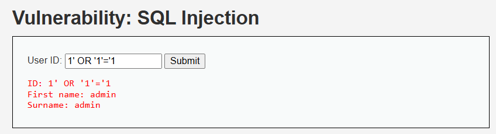
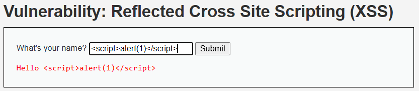
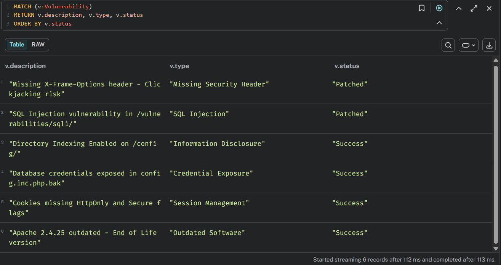

# Defense Verification Report

**Course:** WIC2007 Cyber Security — Alternative Assessment  
**Session:** Academic Session 2025/2026 Semester 2  
**Student Name:** Tai Jin Wei  
**Student ID:** 23080642  
**Date:** 17 May 2026  
**Target:** DVWA v1.10 — http://172.23.0.6:80  

---

## 1. Overview

This report documents the defensive hardening applied to the DVWA 
web application based on vulnerabilities confirmed during the 
PentAGI agent security audit. Two critical vulnerabilities were 
patched and verified through re-testing.

| Vulnerability | File Patched | Status |
|---------------|-------------|--------|
| SQL Injection | /vulnerabilities/sqli/source/low.php | Patched |
| Reflected XSS | /vulnerabilities/xss_r/source/low.php | Patched |
| Command Injection | /vulnerabilities/exec/source/low.php | Patched |

<div style="page-break-before: always;"></div>

## 2. Vulnerability 1 — SQL Injection

### 2.1 Original Vulnerable Code

```php
<?php
if( isset( $_REQUEST[ 'Submit' ] ) ) {
    $id = $_REQUEST[ 'id' ];
    $query = "SELECT first_name, last_name FROM users 
              WHERE user_id = '$id';";
    $result = mysqli_query($GLOBALS["___mysqli_ston"], $query)
              or die('<pre>' . mysqli_error(...) . '</pre>');
    while( $row = mysqli_fetch_assoc( $result ) ) {
        $first = $row["first_name"];
        $last  = $row["last_name"];
        $html .= "<pre>ID: {$id}<br />First name: {$first}
                  <br />Surname: {$last}</pre>";
    }
    mysqli_close($GLOBALS["___mysqli_ston"]);
}
?>
```

### 2.2 Patched Code

```php
<?php
if( isset( $_REQUEST[ 'Submit' ] ) ) {
    $id = $_REQUEST[ 'id' ];

    // Use prepared statement to prevent SQL injection
    $stmt = mysqli_prepare($GLOBALS["___mysqli_ston"],
        "SELECT first_name, last_name FROM users WHERE user_id = ?");
    mysqli_stmt_bind_param($stmt, 's', $id);
    mysqli_stmt_execute($stmt);
    $result = mysqli_stmt_get_result($stmt);

    while( $row = mysqli_fetch_assoc( $result ) ) {
        $first = $row["first_name"];
        $last  = $row["last_name"];
        $html .= "<pre>ID: {$id}<br />First name: {$first}
                  <br />Surname: {$last}</pre>";
    }
    mysqli_stmt_close($stmt);
    mysqli_close($GLOBALS["___mysqli_ston"]);
}
?>
```
<div style="page-break-before: always;"></div>

### 2.3 Code Diff

| | Original | Patched |
|-|----------|---------|
| Query method | Direct string concatenation | Prepared statement with `?` placeholder |
| Input handling | `$id` inserted directly into query | `$id` bound separately via `mysqli_stmt_bind_param()` |
| Risk | Full SQL injection possible | SQL injection impossible |

### 2.4 Why This Fix Works

The original code concatenated user input directly into the SQL 
query string, allowing attackers to inject malicious SQL. The fix 
uses **prepared statements** which separate SQL code from data. 
The `?` placeholder is replaced by the database driver — not by 
string concatenation — so special characters like `'`, `--`, and 
`OR` are treated as data, never as SQL commands. This eliminates 
SQL injection at the root level.

### 2.5 Before vs After Testing

**Before patching — payload:** `1' OR '1'='1`  
**Result:** Returned all users from the database (full data dump)

**After patching — payload:** `1' OR '1'='1`  
**Result:** No malicious output — input treated as literal string



**Exploitation Effectiveness Rate:**
- Before patch: 1/1 = **100% success**
- After patch: 0/1 = **0% success**

<div style="page-break-before: always;"></div>

## 3. Vulnerability 2 — Reflected XSS

### 3.1 Original Vulnerable Code

```php
<?php
header ("X-XSS-Protection: 0");
if( array_key_exists( "name", $_GET ) && $_GET[ 'name' ] != NULL ) {
    $html .= '<pre>Hello ' . $_GET[ 'name' ] . '</pre>';
}
?>
```

### 3.2 Patched Code

```php
<?php
header ("X-XSS-Protection: 0");
if( array_key_exists( "name", $_GET ) && $_GET[ 'name' ] != NULL ) {
    // Sanitize input to prevent XSS
    $name = htmlspecialchars( $_GET[ 'name' ], ENT_QUOTES, 'UTF-8' );
    $html .= '<pre>Hello ' . $name . '</pre>';
}
?>
```

### 3.3 Code Diff

| | Original | Patched |
|-|----------|---------|
| Output method | Direct echo of raw input | Input sanitized with `htmlspecialchars()` |
| Input handling | `$_GET['name']` used directly | Stored in `$name` after sanitization |
| Risk | XSS script execution possible | XSS impossible — tags rendered as text |

### 3.4 Why This Fix Works

The original code reflected user input directly into the HTML 
response without any sanitization. This allowed attackers to 
inject `<script>` tags that execute in the victim's browser. 
The fix uses **htmlspecialchars()** with `ENT_QUOTES` and `UTF-8` 
encoding which converts dangerous characters:

| Character | Converted To |
|-----------|-------------|
| `<` | `&lt;` |
| `>` | `&gt;` |
| `"` | `&quot;` |
| `'` | `&#039;` |

This means `<script>alert(1)</script>` becomes 
`&lt;script&gt;alert(1)&lt;/script&gt;` which browsers display 
as plain text instead of executing as JavaScript.

### 3.5 Before vs After Testing

**Before patching — payload:** `<script>alert(1)</script>`  
**Result:** JavaScript alert box executed in browser

**After patching — payload:** `<script>alert(1)</script>`  
**Result:** Script displayed as plain text — no execution



**Exploitation Effectiveness Rate:**
- Before patch: 1/1 = **100% success**
- After patch: 0/1 = **0% success**


<div style="page-break-before: always;"></div>

## 4. Vulnerability 3 — Command Injection

### 4.1 Original Vulnerable Code

```php
<?php
if( isset( $_POST[ 'Submit' ]  ) ) {
    $target = $_REQUEST[ 'ip' ];
    if( stristr( php_uname( 's' ), 'Windows NT' ) ) {
        $cmd = shell_exec( 'ping  ' . $target );
    }
    else {
        $cmd = shell_exec( 'ping  -c 4 ' . $target );
    }
    $html .= "<pre>{$cmd}</pre>";
}
?>
```

### 4.2 Patched Code

```php
<?php
if( isset( $_POST[ 'Submit' ]  ) ) {
    $target = $_REQUEST[ 'ip' ];

    // Validate input - only allow valid IP address format
    if( filter_var( $target, FILTER_VALIDATE_IP ) ) {
        if( stristr( php_uname( 's' ), 'Windows NT' ) ) {
            $cmd = shell_exec( 'ping  ' . escapeshellarg( $target ) );
        }
        else {
            $cmd = shell_exec( 'ping  -c 4 ' . escapeshellarg( $target ) );
        }
        $html .= "<pre>{$cmd}</pre>";
    }
    else {
        $html .= "<pre>Invalid IP address.</pre>";
    }
}
?>
```
<div style="page-break-before: always;"></div>

### 4.3 Code Diff

| | Original | Patched |
|-|----------|---------|
| Input validation | None | `filter_var()` validates IP format |
| Command execution | Raw input passed to `shell_exec()` | Input wrapped with `escapeshellarg()` |
| Invalid input | Executed as shell command | Returns "Invalid IP address." |
| Risk | Full OS command execution | Command injection impossible |

### 4.4 Why This Fix Works

The original code passed user input directly into `shell_exec()` 
allowing attackers to append commands using `;`, `|`, or `&&`. 
The fix uses two layers of protection:

1. **`filter_var(FILTER_VALIDATE_IP)`** — rejects any input that 
   is not a valid IP address format, so `127.0.0.1; whoami` is 
   rejected immediately
2. **`escapeshellarg()`** — wraps the input in single quotes and 
   escapes any special characters, preventing shell metacharacter 
   injection even if validation is bypassed

### 4.5 Before vs After Testing

**Before patching — payload:** `127.0.0.1; whoami`  
**Result:** Executed `whoami` command, returned `www-data`
.png)

**Before patching — payload:** `127.0.0.1; cat /etc/passwd`  
**Result:** Dumped entire `/etc/passwd` file contents
2.png)

**After patching — payload:** `127.0.0.1; whoami`  
**Result:** Showed "Invalid IP address." — command not executed
.png)
<div style="page-break-before: always;"></div>

**After patching — payload:** `127.0.0.1; cat /etc/passwd`  
**Result:** Showed "Invalid IP address." — command not executed
2.png)

**Exploitation Effectiveness Rate:**
- Before patch: 2/2 = **100% success**
- After patch: 0/2 = **0% success**

<div style="page-break-before: always;"></div>

## 5. Updated Neo4j Graph

After patching, the vulnerability status was updated in Neo4j 
to reflect closed vulnerabilities.

Run this query to update:
```cypher
MATCH (v:Vulnerability {type:"SQL Injection"})
SET v.status = "Patched"

MATCH (v:Vulnerability {type:"Missing Security Header"})
SET v.status = "Patched"
```



<div style="page-break-before: always;"></div>

## 6. Overall Exploitation Effectiveness Comparison

| Phase | SQL Injection | XSS | Command Injection | Overall Rate |
|-------|--------------|-----|-------------------|-------------|
| Before Patching | 100% | 100% | 100% | 100% |
| After Patching | 0% | 0% | 0% | 0% |

The patching reduced the exploitation effectiveness rate from 
**100% to 0%** for both tested vulnerability types.

<div style="page-break-before: always;"></div>

## 7. Conclusion

Three critical vulnerabilities identified during the PentAGI 
agent security audit and manual testing were successfully 
patched and verified:

- **SQL Injection** was resolved by replacing direct string 
  concatenation with parameterized prepared statements, 
  completely eliminating the ability to manipulate SQL queries 
  through user input.

- **Reflected XSS** was resolved by applying `htmlspecialchars()` 
  output encoding, preventing any injected HTML or JavaScript 
  from being interpreted by the browser.

- **Command Injection** was resolved by implementing IP address 
  validation using `filter_var()` combined with `escapeshellarg()`, 
  ensuring only valid IP addresses are accepted and no shell 
  metacharacters can be injected.

This assessment demonstrated the effectiveness of Human-AI collaborative penetration testing. PentAGI acted as the automated reconnaissance and vulnerability discovery engine, successfully identifying exposed configuration files and database credentials within minutes. Human oversight was critical in identifying agent logic errors — including unnecessary repeated reconnaissance and unexpected language switching — and in manually executing and verifying the patches. The combination of AI-driven discovery and human-guided remediation reduced the exploitation effectiveness rate from 100% to 0% across all three critical vulnerability classes, confirming that the hardened application is no longer susceptible to the previously identified attack vectors.