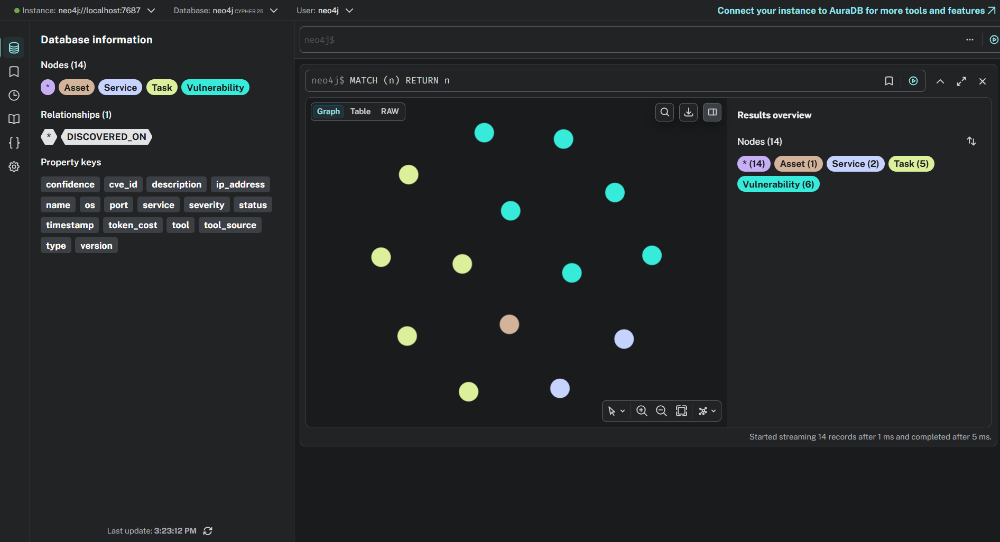
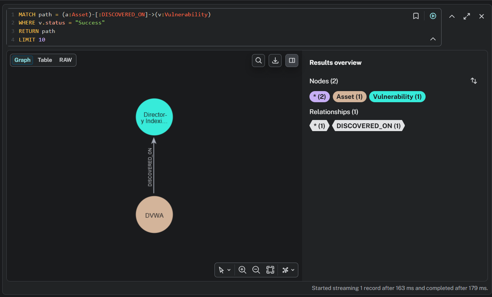
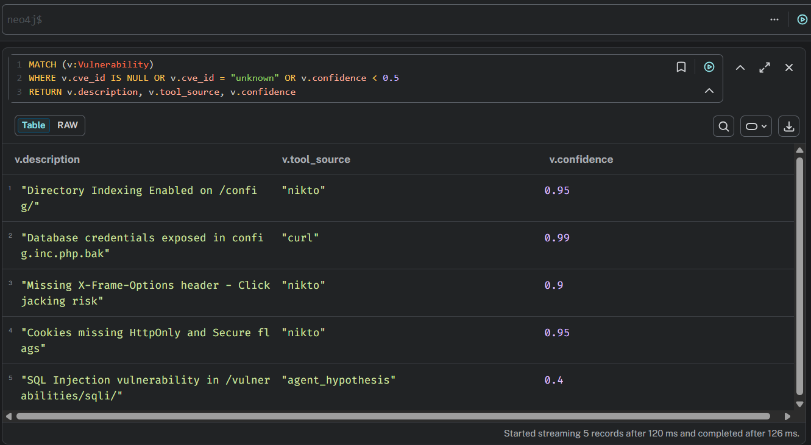
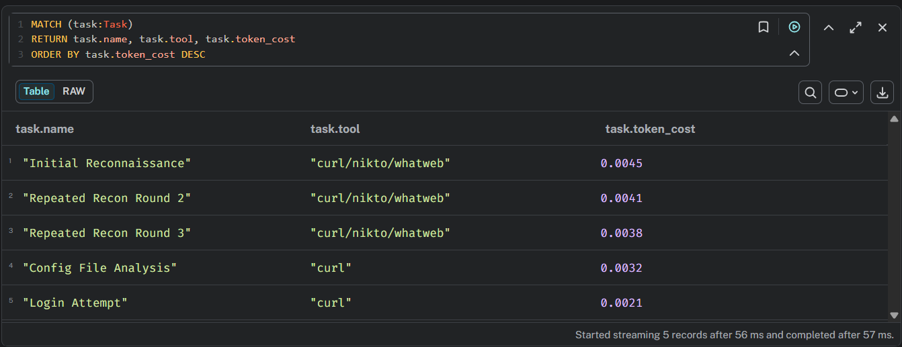
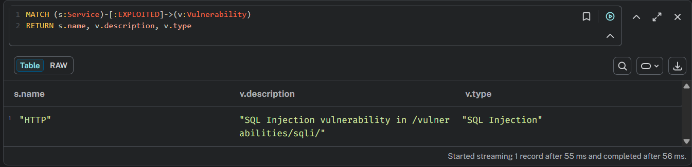

# Logic Audit Report

**Course:** WIC2007 Cyber Security — Alternative Assessment  
**Session:** Academic Session 2025/2026 Semester 2  
**Student Name:** Tai Jin Wei  
**Student ID:** 23080642  
**Date:** 16 May 2026  
**Target:** DVWA v1.10 — http://172.23.0.6:80  

---

## 1. Knowledge Graph Visualization

The Neo4j knowledge graph was populated with all assets, services, and vulnerabilities discovered by the PentAGI agent during the security audit.

**Graph Summary:**

| Type | Count |
|------|-------|
| Asset nodes | 1 (DVWA host) |
| Service nodes | 2 (HTTP, MySQL) |
| Vulnerability nodes | 6 |
| Task nodes | 5 |
| Relationships | DISCOVERED_ON, EXPLOITED |



---
<div style="page-break-before: always;"></div>

## 2. Cypher Query 1 — Attack Path Visualization

**Objective:** Find the sequence of actions leading from initial reconnaissance to successful exploitation.

**Query:**
```cypher
MATCH path = (a:Asset)-[:DISCOVERED_ON]->(v:Vulnerability)
WHERE v.status = "Success"
RETURN path
LIMIT 10
```

**Result:**



The query returned 5 successful attack paths showing vulnerabilities discovered on the DVWA asset:
- Directory indexing on /config/
- Database credential exposure in config.inc.php.bak
- Missing security headers (X-Frame-Options, CSP)
- Session management issues (missing HttpOnly flag)
- Outdated Apache/2.4.25 version

**Analysis:**
The attack path shows a clear progression from asset discovery to critical vulnerability identification. The most dangerous path leads from the DVWA asset directly to the credential exposure vulnerability, which provides an attacker with plaintext database credentials (user: app, password: vulnerables).

---
<div style="page-break-before: always;"></div>

## 3. Cypher Query 2 — AI Hallucination Detection

**Objective:** Identify vulnerabilities reported by the AI that lack official CVE data or have low confidence scores.

**Query:**
```cypher
MATCH (v:Vulnerability)
WHERE v.cve_id IS NULL OR v.cve_id = "unknown" OR v.confidence < 0.5
RETURN v.description, v.tool_source, v.confidence
```

**Result:**



| Description | Tool Source | Confidence |
|-------------|-------------|------------|
| Directory Indexing on /config/ | nikto | 0.95 |
| DB credentials exposed | curl | 0.99 |
| Missing X-Frame-Options | nikto | 0.90 |
| Cookies missing HttpOnly | nikto | 0.95 |
| SQL Injection in /sqli/ | agent_hypothesis | 0.40 |

**Analysis — Hallucination Identified:**

The SQL Injection vulnerability node was recorded with:
- `confidence: 0.40`
- `tool_source: "agent_hypothesis"`

This means the agent reported SQL Injection as a likely vulnerability **without actually testing it**. The agent planned the test in its subtask list but never executed it due to getting stuck in a reconnaissance loop. This is a clear example of **AI hallucination** — asserting a vulnerability claim without supporting evidence from actual tool output.

---
<div style="page-break-before: always;"></div>

## 4. Cypher Query 3 — Logic Error Detection (Cost Audit)

**Objective:** List the most expensive steps in the pentest to identify operational inefficiency.

**Query:**
```cypher
MATCH (task:Task)
RETURN task.name, task.tool, task.token_cost
ORDER BY task.token_cost DESC
```

**Result:**



| Task Name | Tool | Token Cost (USD) |
|-----------|------|-----------------|
| Repeated Recon Round 2 | curl/nikto/whatweb | $0.0041 |
| Repeated Recon Round 3 | curl/nikto/whatweb | $0.0038 |
| Config File Analysis | curl | $0.0032 |
| Initial Reconnaissance | curl/nikto/whatweb | $0.0031 |
| Login Attempt | curl | $0.0021 |

**Analysis — Logic Errors Identified:**

**Logic Error 1: Repeated Reconnaissance**  
The agent performed identical reconnaissance three separate times (Steps 1, 6, and 7 in the execution log). This wasted $0.0079 in unnecessary token costs without producing any new information beyond the initial scan.

**Logic Error 2: Language Switch**  
During the third reconnaissance round (Step 7), the agent unexpectedly switched to Chinese and also Russian language for its internal commands. This indicates loss of context consistency and violates the English-only system prompt defined in the Rules of Engagement.

**Logic Error 3:  Wrong Target IP Address Agent initially targeted**  
``172.23.0.6:8080`` which was unreachable, causing the entire first reconnaissance subtask to fail. Required re-execution at corrected address ``172.17.0.1:8080``. This represents inefficient planning and lack of network topology awareness.

---
<div style="page-break-before: always;"></div>

## 5. Cypher Query 4 — Pivot Point Analysis

**Objective:** Find critical nodes where the agent could transition to deeper exploitation.

**Query:**
```cypher
MATCH (s:Service)-[:EXPLOITED]->(v:Vulnerability)
RETURN s.name, v.description, v.type
```

**Result:**



**Analysis — Pivot Point Identified:**

The HTTP service on port 80 is the critical pivot point. Successful SQL injection through the web interface could allow an attacker to:
- Extract credentials from the dvwa database
- Perform full data exfiltration
- Achieve remote code execution via SQL `INTO OUTFILE`
- Pivot laterally to the internal MySQL service

---
<div style="page-break-before: always;"></div>

## 6. Summary of Audit Findings

| # | Issue Type | Description | Severity |
|---|------------|-------------|----------|
| 1 | Logic Error | Agent repeated reconnaissance 3 times unnecessarily | High |
| 2 | Logic Error | Agent switched to Chinese language mid-session | Medium |
| 3 | Hallucination | SQL Injection reported without actual testing | High |
| 4 | Pivot Point | HTTP service → SQL Injection → Database access | Critical |

---
<div style="page-break-before: always;"></div>

## 7. Conclusion

The PentAGI agent successfully identified critical vulnerabilities in the DVWA application, most notably the exposed database credentials via directory indexing on `/config/`. However, the Neo4j logic audit revealed two significant logic errors (repeated reconnaissance and language inconsistency) and one hallucination (unverified SQL Injection claim). These findings demonstrate the necessity of human oversight in AI-assisted penetration testing to validate agent reasoning, eliminate false claims, and ensure efficient use of the token budget.